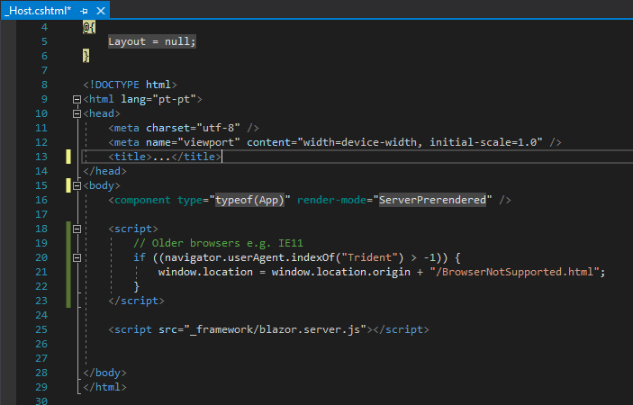
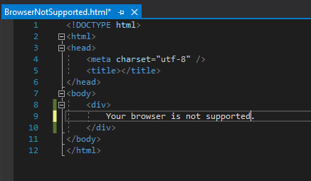

## Microsoft Internet Explorer is not supported by Blazor

* On the file inside Pages -> `_Host.cshtml` is added the javascript to deal with unsupported browsers:

```
    <script>
        // Older browsers e.g. IE11
        if ((navigator.userAgent.indexOf("Trident") > -1)) {
            window.location = window.location.origin + "/BrowserNotSupported.html";
        }
    </script>
```

* Inside the wwwroot -> `BrowserNotSupported.html`, was created a generic page to forward the client to.


* help for identifying different browsers:
https://delib.zendesk.com/hc/en-us/articles/203431259-How-to-find-out-which-browser-and-device-have-been-used-to-submit-a-response

* https://docs.microsoft.com/en-us/dotnet/core/compatibility/aspnet-core/5.0/blazor-browser-support-updated
* https://docs.microsoft.com/en-us/aspnet/core/blazor/supported-platforms?view=aspnetcore-5.0