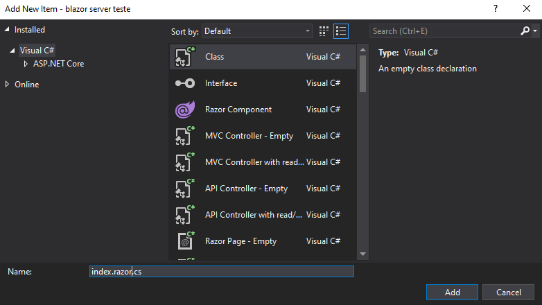
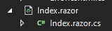
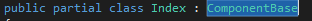

## How to enable code-behind file, having a separate file for html and another for C#

### If you've a component called `index.razor` or `something.razor`
* On the same folder create a class with the same name, `index.razor.cs` or `something.razor.cs` (with the .cs at the end):

* On the new class change the naming scheme from `public class Index` to `public partial class Index : ComponentBase`

* You can now change most of or your code from the .razor component to the .cs file, with a few exceptions like `inject`:

** `@inject IWebHostEnvironment Environment` becomes `[Inject] private Microsoft.AspNetCore.Hosting.IWebHostEnvironment Environment { get; set; }`