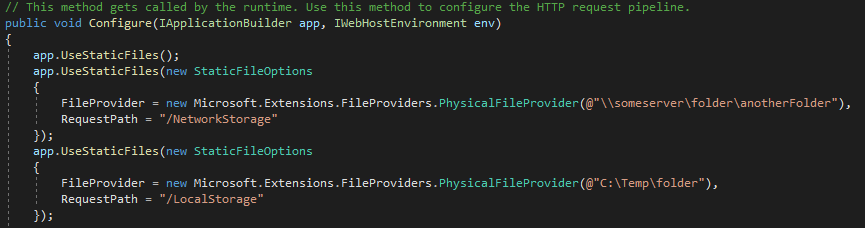

## Adding Virtual Directory in blazor server

* blazor server does not support typical Virtual Directory's created on the IIS, these have to be created on the application side, inside the `Startup.cs` file, example:
```        // This method gets called by the runtime. Use this method to configure the HTTP request pipeline.
        public void Configure(IApplicationBuilder app, IWebHostEnvironment env)
        {
            app.UseStaticFiles();
            app.UseStaticFiles(new StaticFileOptions
            {
                FileProvider = new Microsoft.Extensions.FileProviders.PhysicalFileProvider(@"\\someserver\folder\anotherFolder"),
                RequestPath = "/NetworkStorage"
            });
            app.UseStaticFiles(new StaticFileOptions
            {
                FileProvider = new Microsoft.Extensions.FileProviders.PhysicalFileProvider(@"C:\Temp\folder"),
                RequestPath = "/LocalStorage"
            });
```



* To link to a file for download/display on the html/app side, just use the name declared previously:
** `/NetworkStorage/filename.ext`
** `/LocalStorage/filename.ext`
